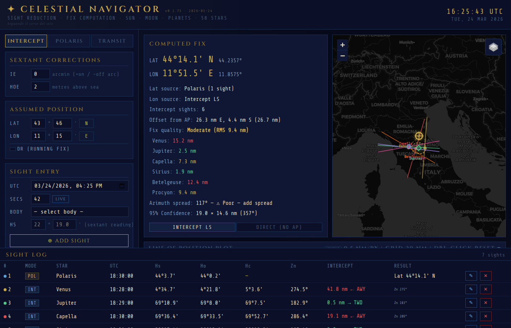
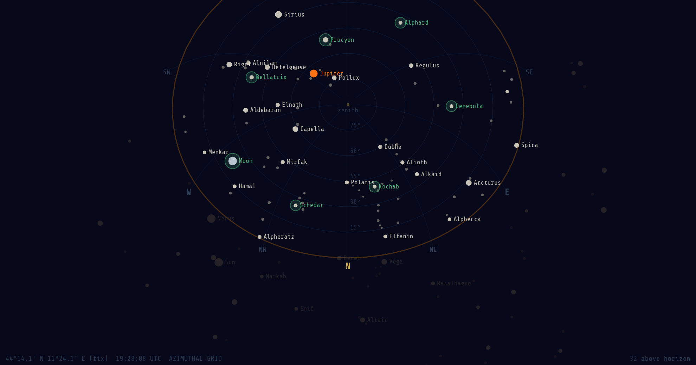
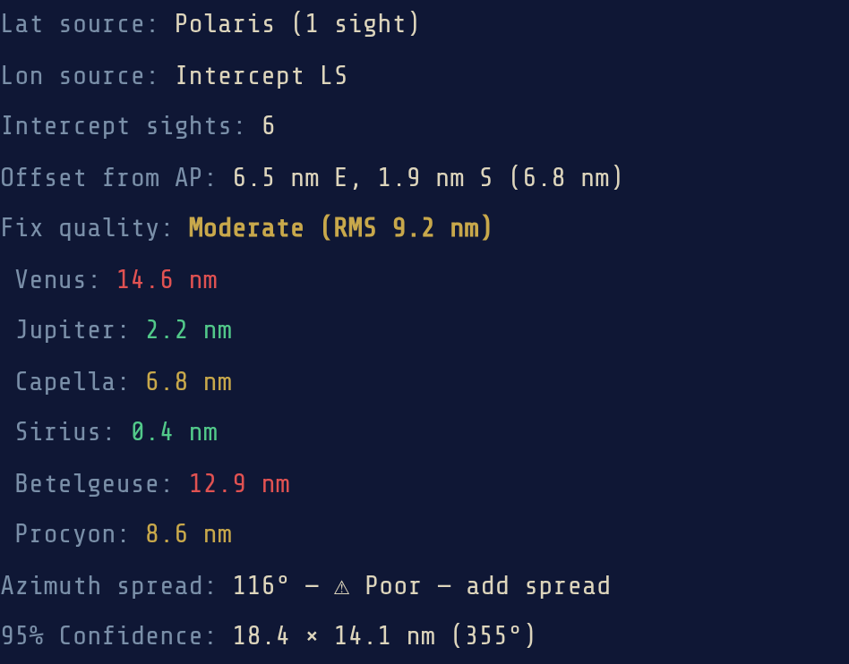

# Celestial Navigator

A browser-based celestial navigation tool for computing position fixes from sextant observations. No server required — runs entirely in the browser as a single HTML file.

**[Live App](https://alexanderkeur-del.github.io/celestial-navigator/)** | **[Almanac Generator](https://alexanderkeur-del.github.io/celestial-navigator/almanac.html)**


## Features

### Sight Reduction
- **Intercept Method** (Marcq St. Hilaire) — computed altitude, azimuth, and intercept from assumed position
- **Direct COP Fix** — AP-free Gauss-Newton iteration on circles of position
- **Polaris Latitude** — direct latitude from Polaris with a0/a1/a2 corrections
- **Meridian Transit** — longitude from star transit observations
- **Sight Averaging** — average multiple sights of the same body to reduce random error

### Celestial Bodies
- **58 Navigational Stars** — full almanac database (J2000.0 with precession)
- **Sun** — Meeus Ch.25 solar position (~1' accuracy)
- **Moon** — Meeus Ch.45 lunar theory with parallax and semi-diameter corrections
- **Planets** — Venus, Mars, Jupiter, Saturn via Standish orbital elements (~1-5')

### Sextant Corrections
- Index Error (IE)
- Dip correction (height of eye)
- Atmospheric refraction (Bennett formula)
- Moon parallax (HP &times; cos Ha) and semi-diameter (upper/lower limb)
- Full Hs &rarr; Ho pipeline with step-by-step workings

### Navigation Features
- **Running Fix (DR)** — advance LOPs for vessel motion (course + speed)
- **Fix Quality** — RMS residual labels (Good / Moderate / Poor) with per-sight diagnostics
- **Confidence Ellipse** — 95% error ellipse from covariance matrix on both LOP plot and map
- **Interactive LOP Plot** — pan, zoom (toward cursor), azimuth lines, intercept lines, fix markers
- **Residual Error Heatmap** — toggleable overlay visualizing RMS error across the LOP plot (blue = low, red = high)
- **COP Fix on Map** — direct circle-of-position fix shown as a green diamond on the Leaflet map
- **Leaflet Map** — dark/satellite/standard tiles with nautical chart overlay, LOPs, and body labels
- **Live AP Recalculation** — all sights update when assumed position changes

### Star Finder
- **North Polar Stereographic Chart** — interactive sky plot centered on the NCP
- **Azimuthal and Equatorial Grids** — switchable coordinate overlays
- **Sight Planning** — suggests 5-7 optimal bodies with best azimuth spread for your position and time
- **Zoom and Pan** — scroll to zoom, drag to reposition, double-click to reset

### Save / Load
- **Auto-save** — session persists in localStorage, restored on next visit
- **JSON export/import** — save and load full sessions
- **CSV export** — sight log as spreadsheet-compatible CSV
- **GPX export** — fix position as waypoint for mapping apps

### Offline
- Progressive Web App (PWA) with service worker
- Works offline after first visit (except map tiles)

## Getting Started

Open `index.html` in any modern browser. No build step, no dependencies to install. Or visit the **[live app](https://alexanderkeur-del.github.io/celestial-navigator/)** directly.

### Quick Tutorial

**1. Load the demo session**

The fastest way to see the tool in action is to click **LOAD DEMO** at the bottom of the page. This loads a pre-built evening twilight session over Florence with Polaris, Venus, Jupiter, and four stars. You'll see the computed fix, LOPs on the map, the confidence ellipse, and sight workings immediately.

**2. Take your first manual sight**

1. Set your **Assumed Position** (latitude and longitude) in the top panel, or leave the default.
2. Set the **UTC date and time** of your observation. You can toggle **LIVE UTC** to auto-fill the current time.
3. Choose a celestial body from the dropdown — the **Suggested Bodies** list shows the best picks for your position and time.
4. Enter your **sextant altitude** (Hs) in degrees and minutes. Set the **Index Error** and **Height of Eye** if known.
5. For Moon sights, select the **limb** (upper or lower) — parallax and semi-diameter are applied automatically.
6. Click **ADD SIGHT**. The app computes the observed altitude (Ho), computed altitude (Hc), azimuth (Zn), and intercept.

**3. Get a fix**

After adding two or more sights, the app computes a position fix. The fix appears as a red cross on both the **LOP plot** and the **Leaflet map**. A 95% confidence ellipse shows the fix uncertainty.

- Toggle between **LS Intercept** (least-squares intercept method) and **Direct COP** (circle-of-position iteration) using the radio buttons.
- Use **Show Workings** on any sight to see the full Hs &rarr; Ho correction pipeline.
- Enable the **Residual Heatmap** on the LOP plot to visualize where the fix has the lowest error.

**4. Running fix**

If you're underway, enter your **course** and **speed** in the Running Fix panel. The app advances earlier LOPs for vessel motion so they can be combined with later sights.

**5. Star finder**

Open the **Star Finder** panel to see a north polar stereographic sky chart for your position and time. It shows all 58 navigational stars, planets, the Sun, and Moon, with the horizon circle for your latitude. Use it to plan which bodies to observe.

**6. Save your work**

Sessions auto-save to localStorage and restore on next visit. Use **Export JSON** to save a full session file, **Export CSV** for a spreadsheet-compatible sight log, or **Export GPX** to get the fix as a waypoint.

## Almanac Generator

The included [almanac page](https://alexanderkeur-del.github.io/celestial-navigator/almanac.html) generates daily almanac data for any date, similar to the official Air Almanac or Nautical Almanac. Use it to:

- **Verify computations** &mdash; cross-check GHA and Dec values used by the navigator
- **Plan observations** &mdash; find sunrise/sunset and twilight times for your latitude
- **Study celestial nav** &mdash; see how GHA Aries, Sun position, and star coordinates change through the day

The almanac includes:
- Sun GHA and Dec at 10-minute intervals (AM/PM layout)
- 58 navigational stars precessed to the selected year
- Sunrise, sunset, civil and nautical twilight for 27 latitudes
- Equation of Time
- Validation against Air Almanac 2026 reference data

## Testing

The project includes `test-almanac.js`, a Node.js test suite that validates the core celestial computations against tabulated reference data (primarily the Air Almanac 2026). It extracts the JavaScript from `index.html`, runs it in a sandboxed VM, and checks:

- **GHA Aries** — against Air Almanac 2026 Day 001 values (tolerance: 1.2')
- **Sun GHA and Dec** — position at multiple dates including solstices and equinoxes (tolerance: 1-3')
- **Moon** — range checks on distance, horizontal parallax, semi-diameter, and declination
- **Planets** — ecliptic range and GHA sanity checks for Venus, Mars, Jupiter, Saturn
- **Sight reduction** — computed altitude and azimuth for known triangle geometries
- **Sextant corrections** — dip, refraction, IE, Moon parallax and semi-diameter
- **Star catalog** — 58 stars present, spot-checks on SHA and Dec for key stars (Polaris, Sirius, Canopus, etc.)

Run with:

```bash
node test-almanac.js
```

### Current status

Sun, planet, sight reduction, and sextant correction tests all pass. The Moon ephemeris has known issues — horizontal parallax, semi-diameter, and declination fall outside expected ranges at several test dates. A few star SHA values (Polaris, Sirius, Betelgeuse) drift slightly beyond tolerance, likely due to precession model simplifications. The GHA Aries daily-rate check has a modular arithmetic issue in the test itself.

Overall: **46/61 tests passing**. The core navigation workflow (Sun, stars, planets, sight reduction, corrections) is solid. Moon accuracy is the main area needing improvement.

### Possible future refinements

- **Moon ephemeris** — the Meeus Ch.45 implementation needs debugging; HP and SD values suggest an error in the parallax or distance calculation at certain dates. A more complete implementation of the lunar periodic terms would bring accuracy within the 54-62' HP range.
- **Star precession** — the current J2000.0 precession model accumulates small errors for stars with high proper motion (e.g. Polaris). Adding proper motion corrections would tighten SHA/Dec accuracy.
- **Planet accuracy** — Standish orbital elements give ~1-5' accuracy; perturbation terms (especially for Jupiter-Saturn interaction) could improve this to sub-arcminute.
- **Sun ephemeris** — already within ~1' of Air Almanac values; periodic perturbation terms from Meeus could push this to sub-arcminute.
- **Additional test coverage** — end-to-end fix computation tests (known sights &rarr; known position), almanac page output validation, edge cases (polar regions, bodies near horizon).
- **Southern hemisphere star finder** — the sky chart is currently north polar only; a south polar view would complete coverage.
- **Lunar distance** — a classic method for determining longitude at sea, not yet implemented.

## Screenshots

| Map with LOPs | LOP Plot | Star Finder |
|---|---|---|
|  |  |  |

| Sanlúcar de Barrameda | Strait of Magellan | Mid-Pacific | Guam |
|---|---|---|---|
|  |  |  |  |

| Fix Result | Workings | Almanac |
|---|---|---|
|  |  |  |

## File Structure

```
index.html          Main app (self-contained, no build step)
almanac.html        Daily almanac page generator
test-almanac.js     Almanac and computation test suite
manifest.json       PWA manifest
sw.js               Service worker for offline support
screenshots/        README screenshots
CHANGELOG.md        Version history
```

## License

MIT
