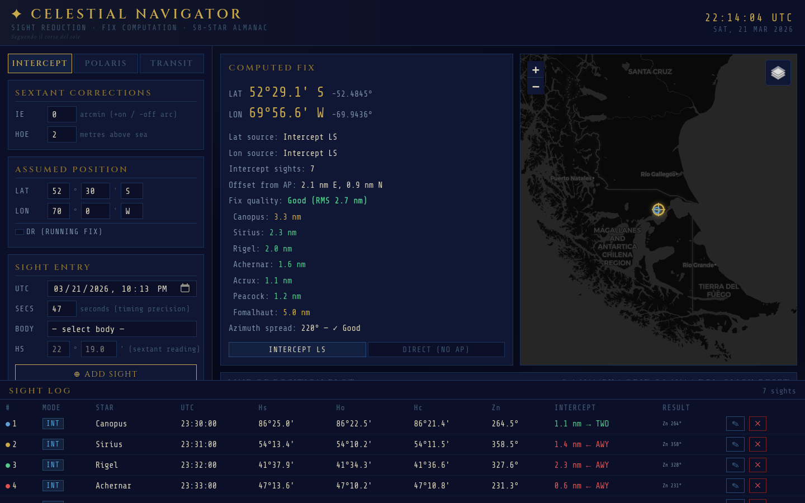
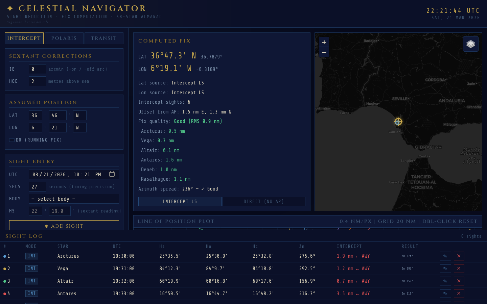
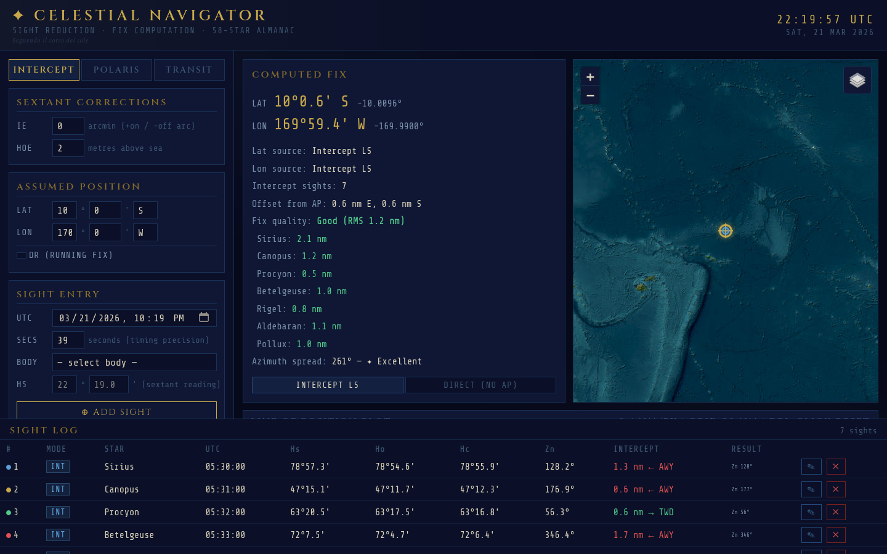
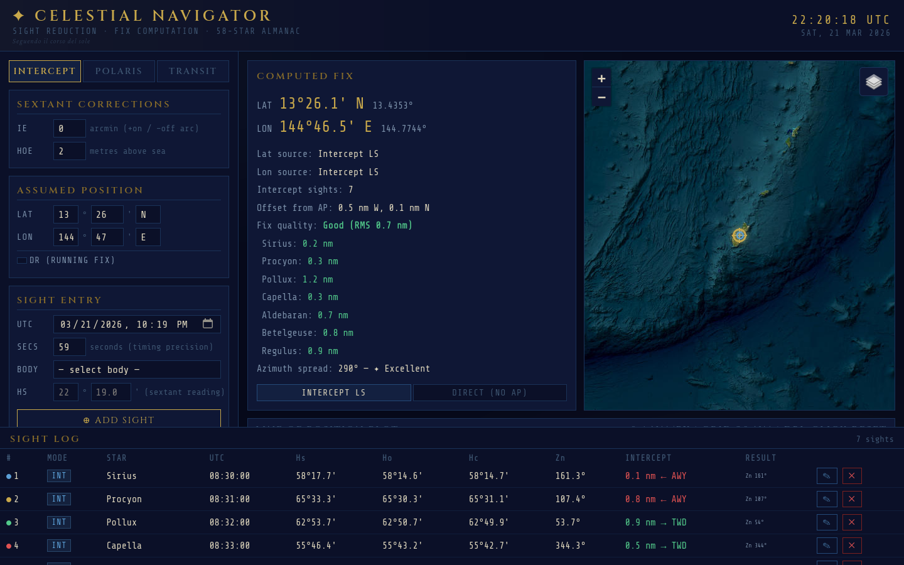
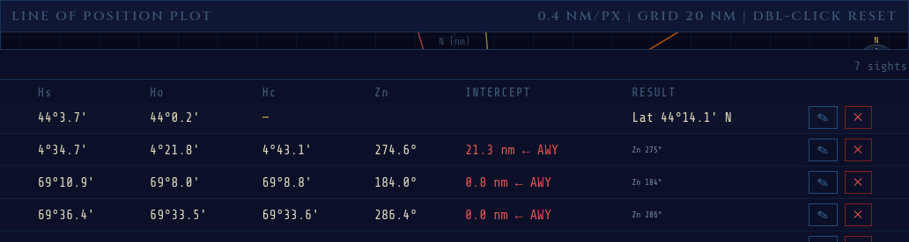
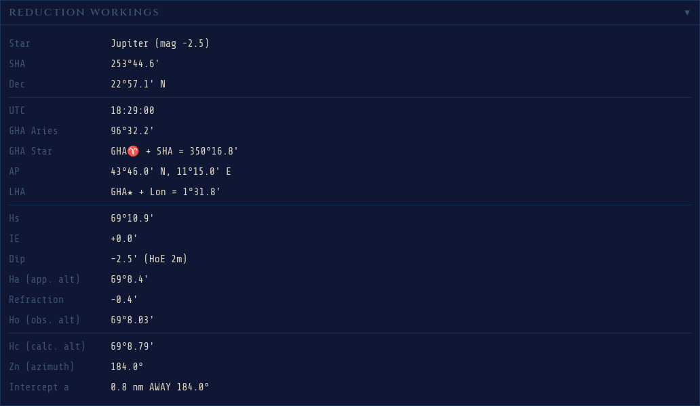
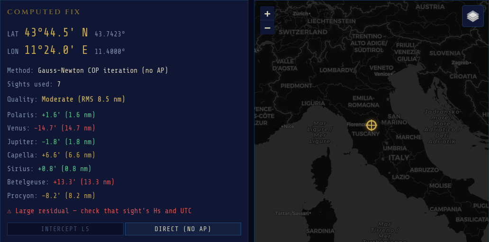
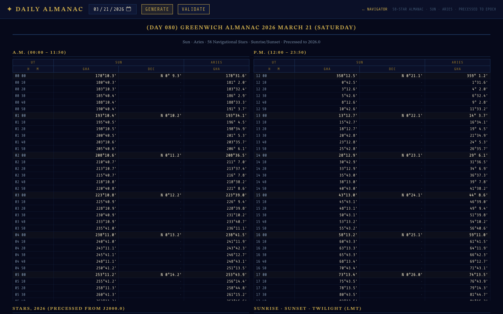
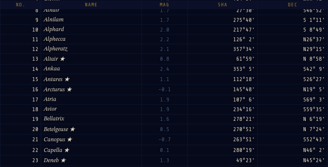

# Celestial Navigator

*Seguendo il corso del sole*

A browser-based celestial navigation tool for computing position fixes from sextant observations. No server required — runs entirely in the browser as a single HTML file.

**[Live App](https://alexanderkeur-del.github.io/celestial-navigator/)** | **[Almanac Generator](https://alexanderkeur-del.github.io/celestial-navigator/almanac.html)**



## Features

### Sight Reduction
- **Intercept Method** (Marcq St. Hilaire) — computed altitude, azimuth, and intercept from assumed position
- **Direct COP Fix** — AP-free Gauss-Newton iteration on circles of position
- **Polaris Latitude** — direct latitude from Polaris with a0/a1/a2 corrections
- **Meridian Transit** — longitude from star transit observations

### Celestial Bodies
- **58 Navigational Stars** — full almanac database (J2000.0 with precession)
- **Sun** — Meeus Ch.25 solar position (~1' accuracy)
- **Planets** — Venus, Mars, Jupiter, Saturn via Standish orbital elements (~1-5')

### Sextant Corrections
- Index Error (IE)
- Dip correction (height of eye)
- Atmospheric refraction (Bennett formula)
- Full Hs &rarr; Ho pipeline with step-by-step workings

### Navigation Features
- **Running Fix (DR)** — advance LOPs for vessel motion (course + speed)
- **Fix Quality** — RMS residual labels (Good / Moderate / Poor) with per-sight diagnostics
- **Interactive LOP Plot** — pan, zoom (toward cursor), azimuth lines, fix markers
- **Leaflet Map** — dark/satellite/standard tiles with nautical chart overlay
- **Live AP Recalculation** — all sights update when assumed position changes

### Offline
- Progressive Web App (PWA) with service worker
- Works offline after first visit (except map tiles)

## Usage

Open `index.html` in any modern browser. No build step, no dependencies to install.

1. Set your **Assumed Position** (or use default London)
2. Select a celestial body (star, Sun, or planet)
3. Enter your **sextant reading** (Hs) and **UTC time**
4. Click **ADD SIGHT** &mdash; the app computes Ho, Hc, Zn, and intercept
5. Add 2+ sights and view the computed fix

Click **LOAD DEMO** for a pre-loaded session (evening twilight over Florence with Polaris, Venus, Jupiter, and 4 stars).

## Almanac Generator

The included [almanac page](https://alexanderkeur-del.github.io/celestial-navigator/almanac.html) generates daily almanac data for any date, similar to the official Air Almanac or Nautical Almanac. Use it to:

- **Verify computations** &mdash; cross-check GHA and Dec values used by the navigator
- **Plan observations** &mdash; find sunrise/sunset and twilight times for your latitude
- **Study celestial nav** &mdash; see how GHA Aries, Sun position, and star coordinates change through the day

The almanac includes:
- Sun GHA and Dec at 10-minute intervals (AM/PM layout)
- 58 navigational stars precessed to the selected year
- Sunrise, sunset, civil and nautical twilight for 27 latitudes
- Equation of Time
- Validation against Air Almanac 2026 reference data

## Screenshots

| Sanlúcar de Barrameda | Strait of Magellan | Mid-Pacific | Guam |
|---|---|---|---|
|  |  |  |  |

| LOP Plot | Sight Log | Workings |
|---|---|---|
|  |  |  |

| Direct COP Fix | Almanac | Star Catalog |
|---|---|---|
|  |  |  |

## File Structure

```
index.html          App shell (dual-mode CSS layout, d3 + EXIF CDN)
almanac.html        Daily almanac page generator
js/                 ES modules (math, catalog, sight-reduction, fix, etc.)
manifest.json       PWA manifest
sw.js               Service worker for offline support
screenshots/        README screenshots
```

## License

MIT
